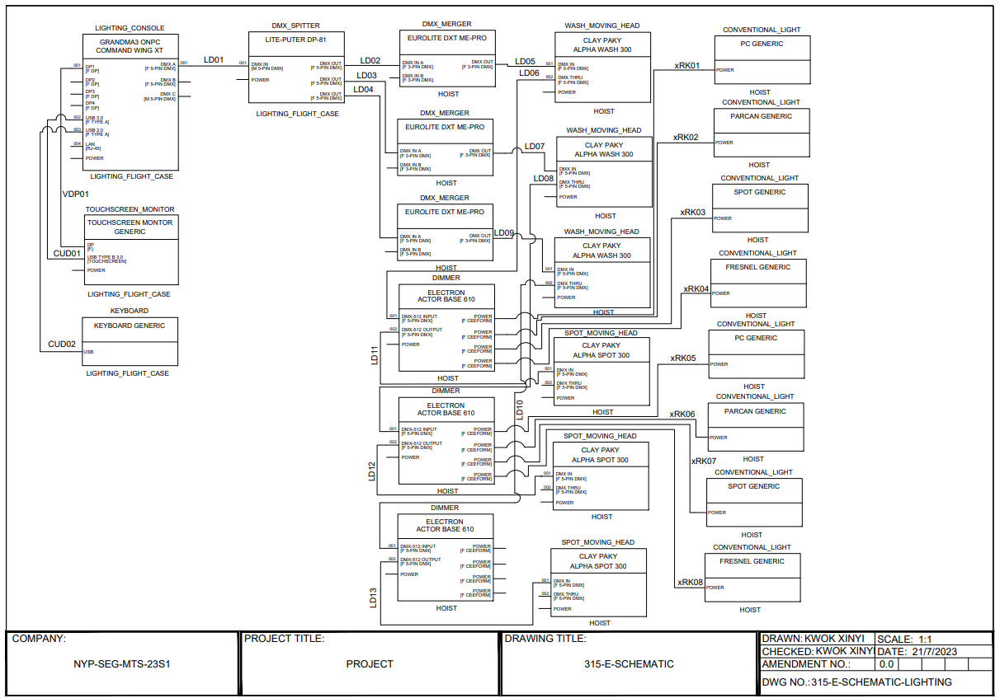
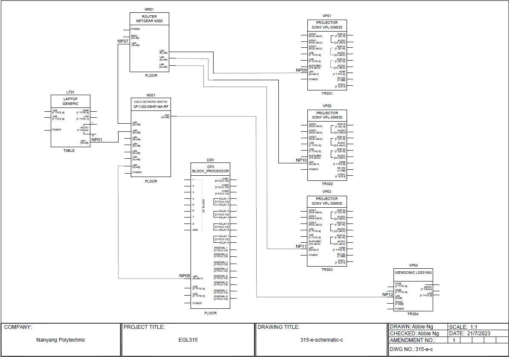
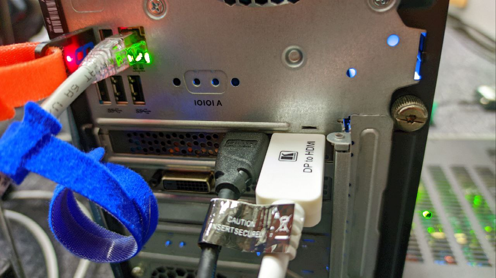
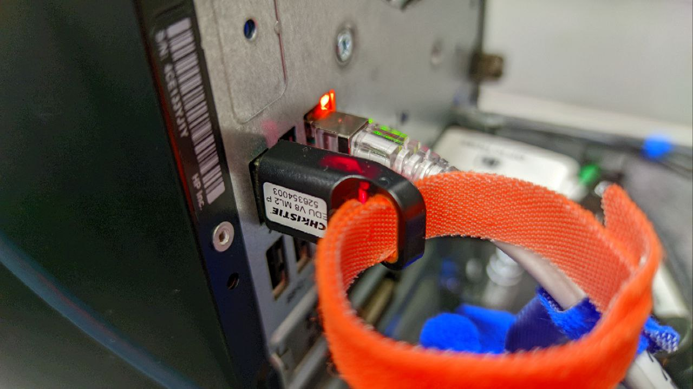
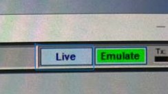
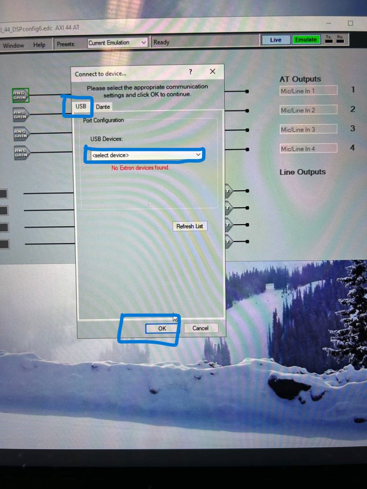
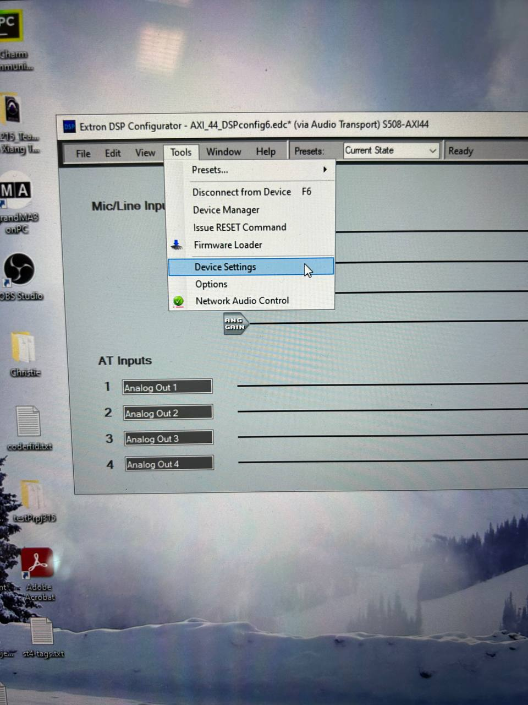

# Istor-a
### Project Introduction
Title : The Great Diamond Heist

* Welcome to the mesmerising world of "henry stickmin" an immersive and exhilarating gaming experience. The game is filled with many different possibilities, weapons, and unforgettable adventures. In this epic journey, you will play as henry stickmin, the main character conquering formidable challenges to steal The Great Diamond.

# Objective:
 - We aim to take advantage of this opportunity to educate learners further about Audio Visual (AV) Technology and how we employ it to present our exhibits, creating a more engaging experience. We want to achieve our aims by using shadows to take a fresh twist on shadow puppeting. 

## Slogan:
   - "Making every child a genius". We strive to be the beginning (origin) of every learner's journey. 

---

## Table of Content:

- **[Team Members Infomation](#Team-Members-Information)**

- **[Storyboards](#Storyboard)(All Stations + Descriptions )**
   - [Station 1](#Station-1)
   - [Station 2](#Station-2)
   - [Station 3](#Station-3)
   - [Station 4](#Station-4)

- **[Gameplay](#Gameplay)**

- **[Setup Progress](#Setup-Progress)**
   - **System Diagrams**
      * [Video](#System-Diagram-for-Video)
      * [Audio](#System-Diagram-for-Audio)
      * [Lighting](#System-Diagram-for-Lighting)
      * [Controls](#System-Diagram-for-Controls)
         + [Projector](#Projector-Control)
         + [Phidget *(All Stations)*](#Phidget-Control)

- **[Floor Plan](#Floor-Plan)**
   - Overall top view
   - Details top view per station
   - Details side view per station
   - Detailed of the equipments (placed at both top corner of the room)

- **[Installation](#Installation)**
   - [Video](#Video-System)
   - [Audio](#Audio-System)
   - [Lighting](#Lighting-System)
   - [Control](#Control-System)
   - [Phidget-Control-System](#Phidget-Control-System)

- **[Operational and Testing](#Operational-and-Testing)**
   - [GrandMA3 on PC](#GrandMA3-on-PC)
   - [PB management](#PB-management)
   - [Christie Pandora Box](#Christie-Pandora-Box)
   - [*Interactivity*](#Interactivity)
      - [Station 1](#Station-1)
         - Side view of station 1
         - Shadow Puppetry Element
      - [Station 2](#Station-2)
         - Side View

- **[Troubleshooting](#Troubleshooting)**
   - [Installation](#Installation)
   - [Operational](#Operational)
      - [PB Management](#PB-Management)
      - [Christie Pandora Box](#Christie-Pandora-Box)
      - [Widget Designer](#Widget-Designer)
      - [Network](#Network)

---

## Team's Member Infomation

### Abbie Ng (Team Leader)
 * Widget Programming - Control
 
 * Christie Pandora Box - Meshing + Cue

* Audio System 

* Content Props (Interaction)

* Content creation 

### Sean (Assistant Leader)

 * Christie Pandora Box - Meshing + Cue

 * Video System Setup

 * Content Props (Interaction)

 * Audio System Setup

### William (Member)
 * Lighting - grandMA3 programming

 * Video System Setup

### Kwok Xinyi (Member)
 * Content creation

 * Booth designing - Instructions for each station

 * Content Props (Interaction)

### Jerome (Member)
 * Audio system

 * Networking Setup - Router , Projector, Laptop IP Addresses

 * Audio System Setup

 * Content creation

---

## Storyboard

 

### Station 1

* From the image above is our station 1 storyboard. It depicts the mayor grand opening of the museum, while showcasing the **priceless diamond**. It then pans out to show the main character, Henry, who plans to steal the **priceless diamond** to pay off his late rent of the house.

 

### Station 2

* At the start of station 2, it shows you **6 different options** for you to choose from. There  are **2 different scenerios (A and B)** from here. 

* From **scene A**, there are **3 options** to select from and *1 of them* is ***CORRECT***. If **WRONG**, the retry scene will *replay* until you picked the right choice. When the right option is selected, the next scene will be where you had successfully entered the museum, and is planning on how to bypass  2 guards, with **3 additional options + 1 timer**. The retry scene will *replay* until the right option is selected. Once the right option is selected, the scene will end off where you successfully bypass 2 guards and is now planning on how to bypass the 3rd guard, while you are getting closer to the diamond.

* From **scene B**, there are **3 options** to select and *1 of them* is ***CORRECT***. The retry menu will *replay* when **Wrong option** is picked. If the right option is selected,  the next scene will bring you to the roof of the museum where you are given another **4 options** to bypass the guard. When you picked the wrong option, the retry scene will *replay* until you picked the right choice. Once you selected the right option, the scene will end off where you successfully bypass the guard and entered the museum from the rooftop, and is now planning on how to steal the diamond from the catwalk above.

 

### Station 3

Following up from Station 2 of **scene A**, you start off with bypassing 1 guard thats guarding the door. You are given **2 options**. If fail, retry scene will play. If not, you will proceed on infront of the door, towards to the diamond. You are now given additional **4 options**. The retry scene will replay if you selected the **wrong option**. Once the right option is picked, the scene will end off where the Chaos Agency is notified of the Chaos happening in the museum.

* For **scene B**, you are given **3 options** to get closer to the diamond. If ***Wrong option*** is picked, the retry scene will *replay* until the right option is selected. When the right option is selected, the next scene will be how you plan to steal the diamond by giving you **2 additional options** to select from. The selection interface will *replay* until the right option is selected. After successfully stealing the diamond, you now stuck in a corridor with 2guards thats near an exit door. From here, you are given **3 options** to choose from. If fail, retry scene will *replay* until the the **right option** is picked. Once the **right option** is picked, the scene will end off where u have to bypass 1 more guard.

 

### Station 4

* For **scene A**, the scene starts off with the user selecting from their given **4 options**. The replay scene will *replay* until the right option is selected. Once the right option is selected, the next scene will be where you are escaping from all the Chaos that is happening in the museum, without the diamond. However, at the end of the scene, the diamond had sucessfully flew from the museum and landed next to you. *Task finished Successfully?*

* For **scene B**, the scene starts off where you had to bypass 1 guard that has a weapon in hand. You are given **4 options** to pick from. If fail, the replay scene will *replay* until the right option is picked. If the right option is picked, the scene will end off where you had successfully stole the diamond from the museum undetected.

 
 

## Gameplay

 

### Stealing the Diamond

- Every stations has a table next to the projector, with all the interactivities available for users to interactive with.

- Press the *Big Button* to start the game

- Different choices give you different results. (2 different scenarios). Do play through them to maximise the immersive experience we have install for you!

- Enjoy and have fun!

---
# Setup Progress
## System Diagram for Video

---
## System Diagram for Audio

---
## System Diagram for Lighting

---
## System Diagram for Control
### Projector Control

### Phidget Control

#### Station 1 & 2

#### Station 3 & 4

---

## Floor Plan

 

### Overall Top View
 

### Detailed Top View of 1 station

### Detailed Side View of 1 station

### Detailed of the equipments (placed at both top corner of the room)

---

## Installation
### Video System

1)Equipment needed:
  * 1 Laptop
  * 4 Projectors
  * 2 Media Server
  * 2 Dongle (Christie Pandora Box License)
  * 1 Network Switch

2) In our setup, there will be 1 laptop, 2 media server and 1 Dongle for each media server. 
   There will be 1 projector for every 1 station.

   

3) Both media servers and Laptop are all interconnected to a network switch via LAN. Each projector is connected to the media server via HDMI.
 
4) In our setup, we have used a pair of HDMI extender due to the location of where the media server and one of the projector is placed. If the location of your equipment is not far from each other, there is no need to use HDMI extenders.

5) If you too want to ensure proper and stable cable management in your setup, you may consider using HDMI extenders.
    * Help reduce hardware issues that relate to the cabling like:
        1) lose connection 
        2) Cable being pulled out
    * Extenders run on LAN cables for extension
        1) LAN cables have a locking mechanism while HDMI cables do not. This ensures that aren't lose or pulled out easily.

6) We are using a software called **Christie Pandora Box**(projection mapping software) to project out our content. 
   To use it, you will need to accquire a dongle that has their license to operate the software. 

7) The dongle is plugged into one of the USB-A ports in the media server.
    
  
8) After stations 1 and 2 are completed, repeat the same steps for stations 3 and 4.

---

### Audio System
* Equipment needed:
  + 4 speakers (JBL Control 23)
  + 1 ampliflier (Crown CT875)
  + 1 dante interface (AXI 44AT)
  + 1 laptop
  + 1 Network Switch

1) In our setup, we will be using 4 passive speakers, 1 ampliflier, 1 dante interface and 1 laptop. 1 speaker is connected for each station and all 4 of them will be connected to an ampliflier crown CT875 as this ampliflier has 4 different channels.

2) All 4 speakers are connected to the ampliflier using speaker cable, each speaker is connected to 1 channel on the amplifier

3) Switch on the power button of the Crown CT875 Amplifier. 
Wait for about a few minutes until the "signal" and the "ready" light lit up (in green).
  

 

4) Turn the Input Attenuation knok to 0 dB.

5) The audio assets are wav. files which are generated from the mp4 video assets using Pandora box's Media Encoder.

6) The sampling rate is set at 48kHz which is the same sampling rate that is set on the Dante Network.

7) Audio assets were placed on the Pandora Box's timeline.

8) We have set the Pandora Box audio output to be configured to PB dante as we will be using a dante interface to route our audio.

9) To use the dante interface, connect it to the laptop. If the laptop LAN port is unavailable, a network switch is required.

10) Next, connect the audio amplifier's 4 inputs use according to this setup to the outputs of the dante interface. For this project, we have connected using LAN cables to carry our audio signal.

11) The analog output from dante interface will send audio to the 8 channel crown amplifier
  
12) To route our audio, we required the use of the Dante Virtual Soundcard and Dante Controller.

13) The Dante Virtual Soundcard is used to output network audio from the laptop.

14) The Dante Controller is used to route audio.
.jpeg)

* How to configure Dante Interface IP Address - If using own network

1) To change the ip address of the dante network, plug mini usb into laptop from dante interface
2) launch DSP configurator
3) Choose the appropriate choice equipment
.jpeg)

4) Click on the live button to start

4) click  on usb and select the appropriate device, to synchronise click pull data.

 

.jpeg)

5) go to tools, under device settings, dante device click on static ip

6) change ip address to appropriate ip address and apply
7) Reboot Dante if necessary

---
### Lighting System

1) In our setup, we will be using the lighting console called the **grandMA3 onPC command wing XT** to program our lights. This lighting console has a built-in MA motherboard, with GrandMA3 onPC software that was already pre-installed inside the console, and the console was running using Windows 10 IoT OS. This requires to connect the touchscreen monitor so that users can be able to view the grandMA3 onPC software and programme or control it on the console.

2) The monitor is connected via the Display Port.
(For touchscreen monitors, there is a USB port located behind the monitor which is delicated for touchscreen feature only, can be connected via the **3.0** USB port, to activate the touchscreen feature on the monitor).
Users can also connect the keyboard and a mouse via the **2.0** USB port.

3) The power button and the DMX Output is loacted at the back of the console. The lighting fixture is connected via the DMX port output.

4) The console is connected to the pandora box via LAN which enables the pandora box to communicate with the grandMA3 console by sending command using OSC so that the lighting console can automatically excute the sequences or the cues that was stored inside the console. The OSC command can be set by using the pandora box widget designer.
--- 
### Control System
We are using 1 cp3 processor, 1 router, 1 network switcher and 1 laptop to control the 4 projectors.
1) The cp3 processor, laptop and all 4 projectors are connected to the network switcher using lan cables.
2) Crestron VT-Pro-e is used to design and create the buttons.
3) Each buttons were given different digital joins digits.
4) 2) SIMPL windows is used to program all the 4 projectors to 'ON' or 'OFF'.
#### Phidget Control System

#### Stations 1 & 2
**In this setup, we will are using 2 Phidget interfaces, 1 Phidget RFID and 1 Phidget Advance servo 8-Motor. 
  The interface we are using is the phidget interface 8/8/8.**

* Note: We have used USB Extenders and HUB due to where the different equipment are placed and insufficent USB-A ports

##### Station 1

1) The sensors we have in station 1 are:
    * 1 Rotary potentiometer
    * 1 Button
    * 1 Phidget Advance servo 8-Motor
    * 1 RC servo motor

2) The Phidget interface and Phidget Advance servo 8-Motor are connected to the laptop via USB-B to USB-A cable. 
   We are using a usb extension in our setup due to the location of where the interface, servo motor and laptop are place.

3) The phidget interface consists of 8 digital and analog inputs.

4) The Rotary potentiometer is connected to one analog input, the Button is connected to one digital input.

7) The Button is to enable for the video to start

8) While the Rotary potentiometer is there as a backup for the button, it also enables the content to be replayable 
  through our program.

9) The Phidget Advance servo 8-Motor is connected seperately from the interface.

10) The RC servo motor is connected to 1 channel in the Phidget Advance servo 8-Motor.

5) For the interactivity to work, we will be using an application called **Widget Designer** to program the button and sensor.

6) To use Widget Designer, you will need to download the application if not downloaded.

7) Program Files can be found under **WD Files** in this GitHub Repository

##### Station 2

1) The sensors we have in station 2 are:
    * 1 Phidget RIFD 
    * 3 Phidget RFID Tags
    * 1 Button
    * 1 Rotary potentiometer

2) The Phidget interface and the Phidget RFID are connected to the laptop via USB-B to USB-A cable. We are using a usb extension in our setup due to the location of where the Phidget interface, Phidget RFID and laptop are placed.

3) The phidget interface consists of 8 digital and analog inputs.

4) The Rotary potentiometer is connected to one analog input, the Button is connected to one digital input.

5) The Phidget RFID is connected to the laptop seperately from the interface.

6) The Button is to enable for the video to start

7) While the Rotary potentiometer is there as a backup for the button, it also enables the content to be replayable 
  through our program.

8) The Phidget RFID has RFID tags for object selection in our content. Each RFID tag is assigned an RFID id.

9) The RFID scanner will read the tag's id and jump to a specific scene (the choice made by the user) and play it.

10) For the interactivity to work, we will be using an application called **Widget Designer** to program the button and sensor.

11) To use Widget Designer, you will need to download the application if not downloaded.

12) Program Files that has been used for out project can be found under **WD Files** in this GitHub Repository.

---

## Operational and Testing

### GrandMA3 onPC
1) Download and install the latest grandMA3 onPC application.

2) On the left side panel, click on the Setting gear icon or press the **Menu** button on the grandMA3 console. A menu option will show up on the screen. Select the **Patch** button.

3) Inside the Patch window, click on **New Fixture**, followed by **Insert New Fixture**. **(If you are doing a new show, please skip to step 4)**

4) Select the **Library** tab and you will see a list of both the lighting Manufacturer names (under Manufacturer tab) and the type of the lighting fixture(under Fixture tab). Select the manufacturer and the lighting fixture that you are using, or you can type it down the name of the manufacturer and the fixture type in the search box. 
**eg. Clay Paky Alpha Wash 300**

   select the most suitable modes and click select.

5) Inside the **Insert New Fixture** window, rename the lighting fixture that is suitable for you to view **(eg. Foor Lights)**. Click on **Patch** tab at the left panel, and type in the suitable universe number followed by the channel number. **eg. The Alpha Wash 300 channel number is set at 121. The cable is connected to universe 1 (which means it is connected to DMX A on the Lighting console).**

    **NOTE: By default, DMX A is universe 1, DMX B is universe 2, and DMX C is universe 3**

6) Select **Please** button and close the patch window (you will see the keep changes message pop up, click save and exit).

7) On the right side, select fixture and select the lighting fixture in the Fixture:Absolute window. At the bottom right, select **Dimmer** tab and on the console use the first rotaty wheel to adjust the brightness of the lighting fixture. **(You can also select other tabs such as position, colours, or beam, and adjust it by using the rotaty wheel on the console)**

### PB Management
1) Download PB management application. Note that you would need to obtain a license to use the software. 

2) In the PB management workspace, wait for the server icon to turn **blue** and its state to say **online** 
   before clicking the icon.

   

3) After clicking on the icon, you would be directed to an interface called the **PB Menu** with different applications.

4) In PB Menu, click on **Pandora Box**.

   

5) You would be shown a client interface. In that page, click on **Full Screen**.

   

### Christie Pandora Box

1) To use Christie pandora box, you would need to download both the Christie pandora box and PB management application. You would also need to obtain a license to use the software. 

2) If all requirements have been fulfilled, you may procced to plug in the dongle that contains the license to use the application into either the laptop if running on local, or a media server if u have one.

3) For the Pandora Box application, simply create a new project to start off. Subsequently, you may either use the assets given by Christie in their own **Christie folder** in **Windows(C:)**, or add your own content by adding into the **Christie folder**.

4) To add your own content, go to file explorer, click on **Windows(C:)**. Then find and click on **Christie**. 

5) In the **Christie folder**, click on **content**. Then drag the content you will be using into the **content folder**.

6) To project out your content, drag the content to a layer in the timeline in pandora box. 

7) To preview your content in pandora box, **right click on local or desktop**, find and click on **toggle preview**. 

8) As this software is a projection software, we can also add something called **editable mesh**, to help us size and fit our content depending on our display area. Right click on your project folder and click on **Add Editable Mesh**. You may rename the mesh to your liking.

9) As we are using a phidget control system, we will be adding cues to our video timeline.

10) To add a cue, go to the time you wish to add a cue, right click, and click on **Add Cue Here**.

11) There are different functions in cue, **Play, Pause, Stop, Jump and Wait**:
    * **Play** function is a play button
    * **Pause** function pauses the video at that the current cue time
    * **Stop** function stops the entire sequence/timeline from playing
    * **Jump** function jumps the cue/time that u have set to jump to
    * **Wait** function delays the video depending on the wait time set

---

## Interactivity

### Introduction
To start, users can scan a QR code which will bring them to an infographic. The infographic will let users know more about our project as well as instructions on how to play. 

Introduction QR code at station:

Introduction QR code:

Introduction infographic:

---

### Station 1
1) This is the set up for station 1:

---

These are the QR codes and infographic for Station 1.

QR code:

Infographic:

---

Interactivity for Station 1:

We have a button and a Rotary potentiometer. The button is used to start the station, while the Rotary potentiometer is to reset the station as well as a backup for if the button fails.

#### Side View

For the button and Rotary potentiometer to work, we used a Phiget Interface 8/8/8 kit to power, transmit and receive protocols from PB. 

---

#### Shadow Puppetry Element
This station has a shadow puppetery element. This shadow puppetery is achieved by attaching a model to a servo motor.

This servo motor is timed on PB using WD for it to move into position and move away at the right moment while the video is running.

**Video of servo motor in action:**
*[Video can be found in the Interacting Folder - Station_1_servo_moving]*

**Video of how servo motor affects video:** 
*[Video can be found in the Interacting Folder - Station_1_servo_effect]*

The servo motor is being driven by a **PhidgetAdvancedServo 8-Motor** which is a servo controller.

---

#### Station 2

This is the set up for station 2:

---

These are the QR codes and infographic for Station 2.

QR code:

Infographic:

---

Interactivity for Station 2:

Options:

Button and Scanner:

For this station's interactivity, we used RFID, buttons and rotary potentiometer.

#### Side View

For station 2, we used RFID tags to let users pick their choices for the game. Throughout our stations, we used card RFID tags, keychain RFID tags as well as disk RFID tags

We put cardboard cutouts of the ingame options onto the RFID tags which help to label and hide the tags

#### Front

#### Back

From Stations 2 to 4, users will be able to pick options that will lead to two different paths. One path is labelled "A" while the other is labelled "B". Users should then follow the labelling and numberings and choose the options in order.

Users can pick any option first. After picking users are advised to keep to one path as deferring would result in a break in the flow of the story. 

Station 2 First Choice:

Station 2 Second Choice:

For users to select their choice, they would have to use these RFID tags and tap it on the RFID reader. This would jump the video to  play the option which users have selected. 

For every group of options, only one of them is correct. When users select the wrong option, the video shown to them will be a fail screen. 

After choosing the right answer, the video will progress the story and give users context of the next station before they have to move on the the 3rd station.

The Rotary potentiometer for this station resets the station as well as act as a backup for if the button fails to work.

---

### Station 3

This is the setup for station 3:

---

These are the QR codes and infographic for Station 3.

QR code:

Infographic:

---

Interactivity for Station 3:

---

### Station 4
This is the setup for 4:

---

These are the QR codes and infographic for Station 3.

QR code:

Infographic:

---

Interactivity for Station 4:

---

## Troubleshooting

### Installation:
* Check that there is power running for all equipment that requires power.
* Make sure that all cables are plugged in properly.
* If HDMI Extenders or USB Extenders are used, make sure that the **Link** is lighted to the supposed colour.
* Do ensure that the cable connection for HDMI Extenders or USB Extenders are not lose if the equipment are being used.
* For the audio speakers, make sure that both inputs from the amplifier have GND.
* Ensure that there is power to power on the DMX Driver if not the light **(LED Strips)** would not be turned on. 

### Operational:

#### PB Management 
* If you press **X** on the client interface and when you press Pandora Box and it says it is open when you have closed it:
    1) Find **Taskbar** and switch it on
    2) Now, you should be able to see the taskbar in your PB Menu page
    3) Find the Pandora Box tab and click on it to get back the Pandora Box client interface

* Ensure that the IP address of the laptop is the same as the PB management too.

#### Christie Pandora Box
* Make sure that dongle is plugged in either in the server or laptop

* If the projector has been switched on and off, and content is not displayed:
   1) Save your file first
   2) Close **Christie Pandora Box** and in PB management, click on **disconnect**
   3) After you have disconnected, you may either:
      - Close the whole PB Management
        OR
      - Right Click on the box which says Server[Number depends on how many servers you have]
      - Find **System** and in that tab, click on **Reboot**

* If you are unable to preview your content in pandora box:
   1) Make sure that you have clicked on **toggle preview**
   2) In pandora box find and click on **all cameras** 

* If you can't find your mesh:
    1) In pandora box find and click on **all cameras** 
    2) Check which **layer output** you are on 

#### Widget Designer
* If open up Phidget Control panel with Widget designer and sensor not working:
    1) Save your File first
    2) Close both applications
    3) Now open up Widget Designer 
    4) Open your saved file 

---
#### Network
1) Netgear router is used and set to wireless connection.
    2) ip address is of router is changed to 192.168.180.5
    3) laptop 1 ip address 192.168.180.9
    4) laptop 2 ip address 192.168.180.7
    5) media server ip address 192.168.180.69
    6) media server ip address 192.168.180.88
2) Static range is 192.168.180.2 to 192.168.180.99
3) Dynamic range is 192.168.180.100 to 192.168.180.254
4) All the equipments ip addresses falls under the static range to prevent interference from other 3rd party devices that connects to the same network.
    
---
