# Istor-a

## Storyboard
 

### Station 1

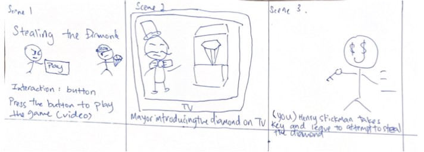
 

### Station 2

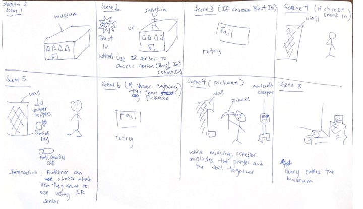
 

### Station 3

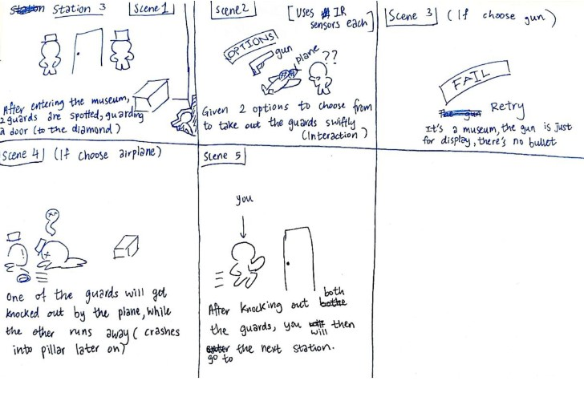
 

### Station 4

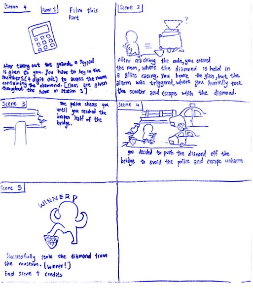

 
 

## Gameplay

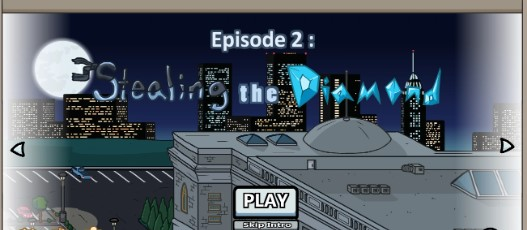
### Stealing the Diamond
1) You are playing as the main character(Henry Stickmin). After the events of Escaping the Prison, you are resting at home. 

2) You tune in to the television where you see the mayor annoucing the grand opening of the new museum. Within the new exhibits sits a priceless diamond.

3) Knowing the value of the diamond, you sought to steal the diamond to pay off his late rent of his house.

4) You will be given several options to choose from to aid your character to successfully steal the diamond.

---
# Setup Progress

## System Diagram for Video

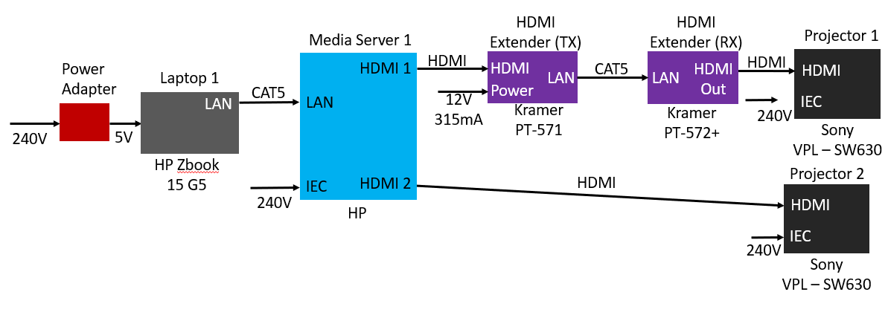
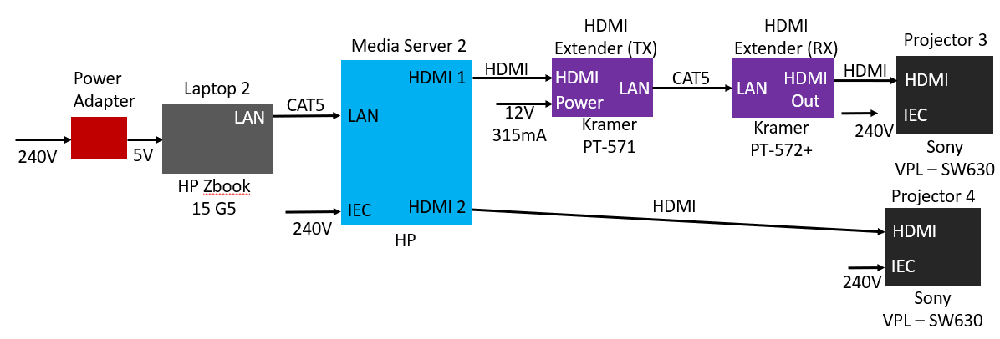

---
## System Diagram for Audio

---
## System Diagram for Lighting
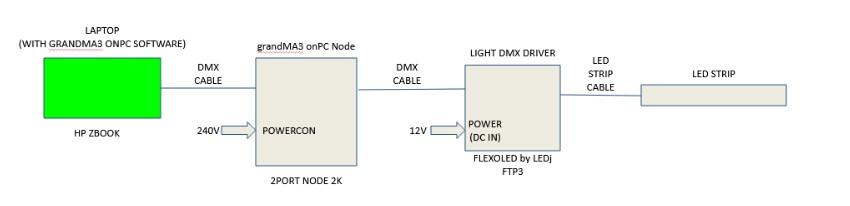

---
## System Diagram for Control
### Projector Control
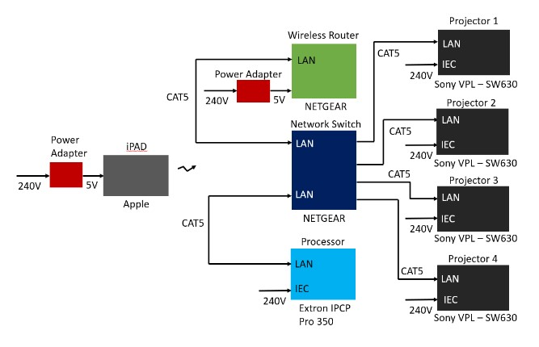

### Phidget Control

#### Station 1 & 2
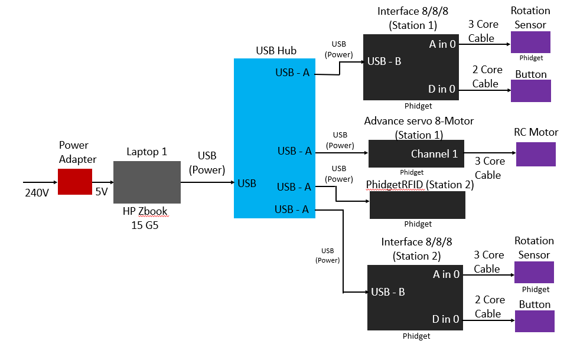

#### Station 3 & 4
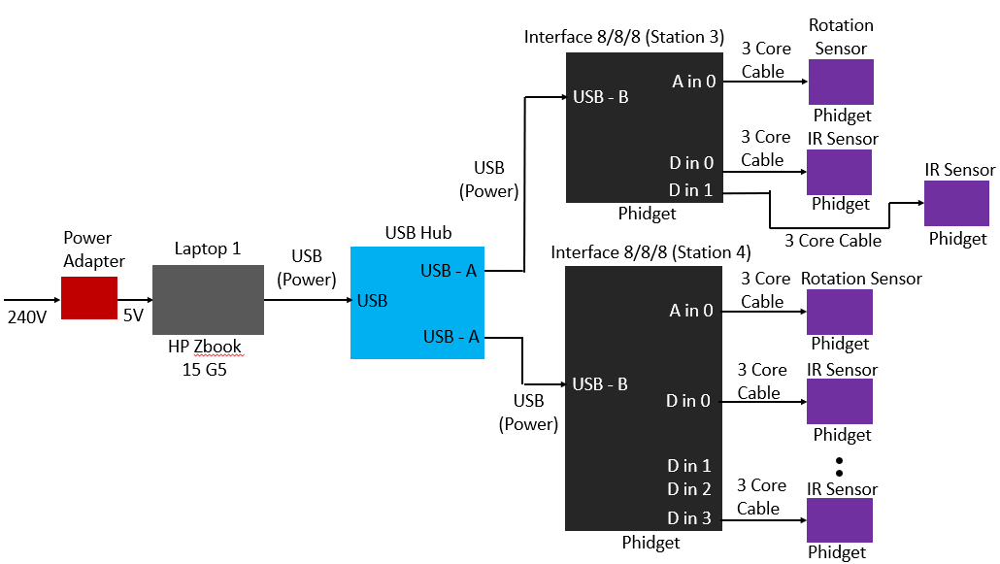

---

## Floor Plan:
### Overall Top View
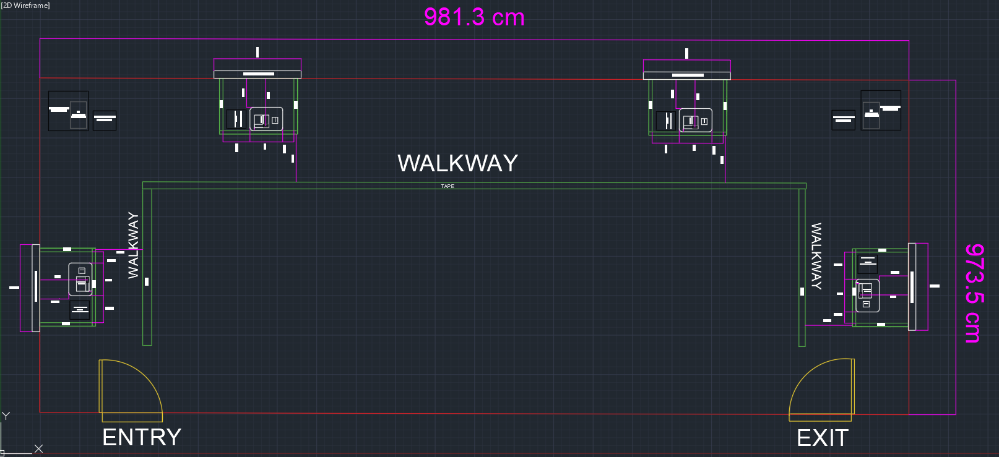

### Detailed Top View of 1 station

### Detailed Side View of 1 station

### Detailed of the equipments (placed at both top corner of the room)

---

## Installation
### Video System

1)Equipment needed:
  * 2 Laptops
  * 4 Projectors
  * 2 Media Server
  * 2 Dongle (Christie Pandora Box License)

2) In our setup, there will be 1 laptop, 1 media server and 1 Dongle for every 2 stations. 
   There will be 1 projector for every 1 station.

3) Each laptop is connected to the media server via LAN. Each projector is connected to the media server via HDMI.
 
4) In our setup, we have used a pair of HDMI extender due to the location of where the media server and one of the projector is placed. If the location of your equipment is not far from each other, there is no need to use HDMI extenders.

5) If you too want to ensure proper and stable cable management in your setup, you may consider using HDMI extenders.
    * Help reduce hardware issues that relate to the cabling like:
        1) lose connection 
        2) Cable being pulled out
    * Extenders run on LAN cables for extension
        1) LAN cables have a locking mechanism while HDMI cables do not. This ensures that aren't lose or pulled out easily.

6) We are using a software called **Christie Pandora Box**(projection mapping software) to project out our content. 
   To use it, you will need to accquire a dongle that has their license to operate the software. 

7) The dongle is plugged into one of the USB-A ports in the media server.
  
8) After stations 1 and 2 are completed, repeat the same steps for stations 3 and 4.

---

### Audio System
1)Equipment needed:
  * 4 speakers
  * 2 amplifiers

1) In our setup, we will be using 4 passive speakers, 1 for each station. And 2 amplifiers, 1 for every 2 stations. 

2) Each speaker is connected to one channel on the amplifier.

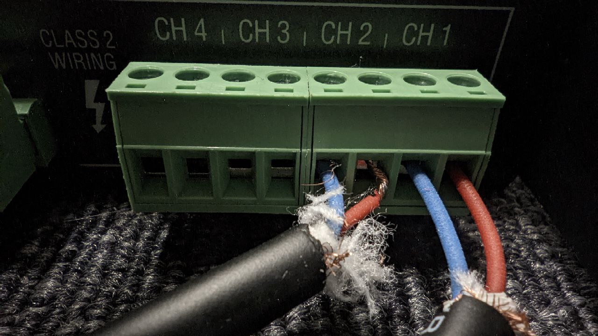

3) The laptop is connected to the amplifier's input 1 and 2 using a 3.5mm audio cable to terminal block.

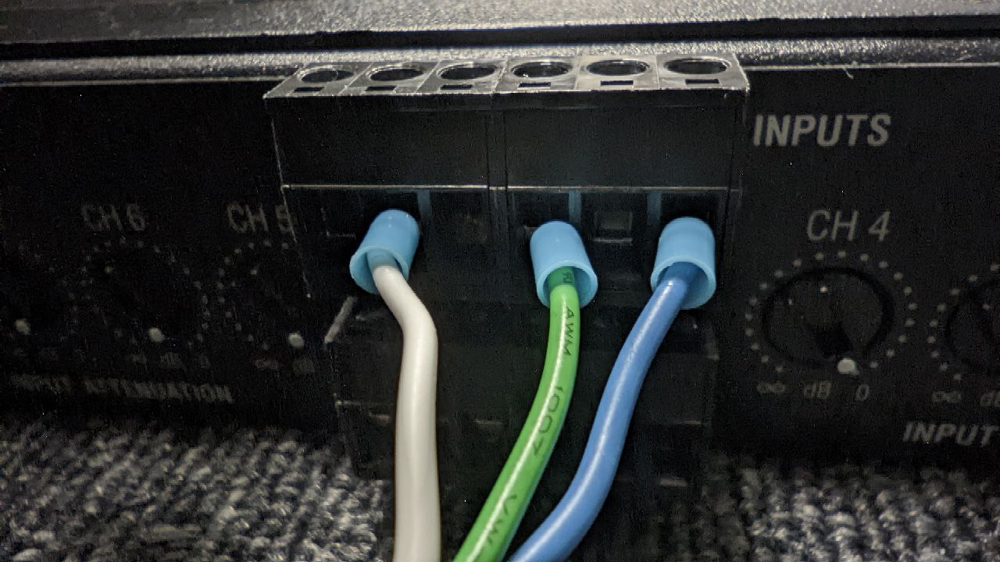

4) Switch on the power button of the Crown CT875 Amplifier. 
Wait for about a few minutes until the "signal" and the "ready" light lit up (in green).
  

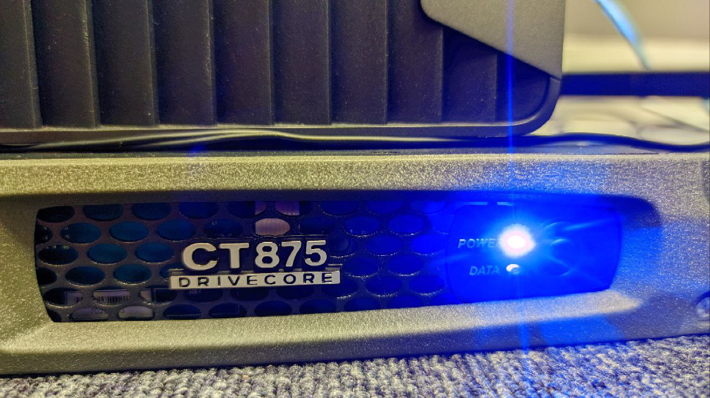
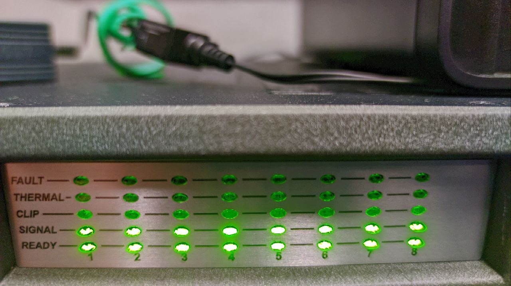

 

5) Turn the Input Attenuation knok to 0 dB.
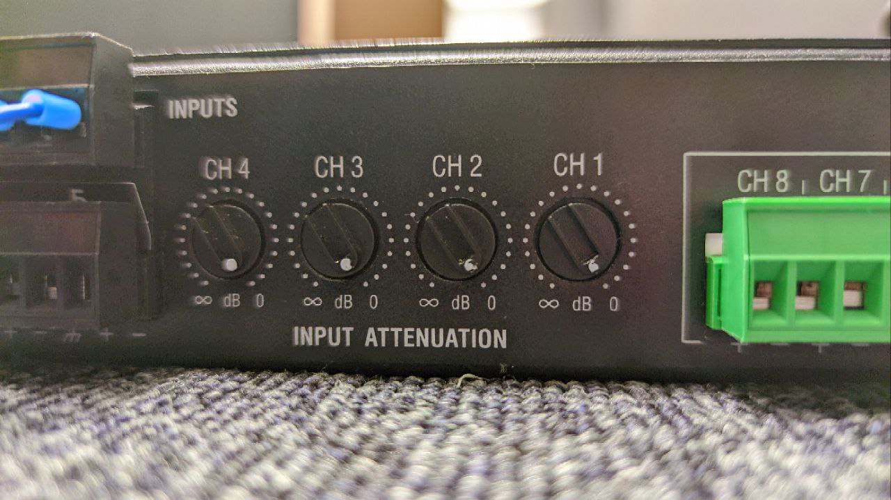

---
### Lighting System

1) In our setup, we will be using a software called **grandMA3** to program our lights.

2) To use the software, we need a **grandMA3 Node**. 

3) This node is connected to the laptop via a usb to dmx adapter and dmx cable.

4) In our setup, we are using LED strips. To connect the LED strips the the node, we have used a Light DMX driver.

5) This Light DMX Driver is connected to the node via HDMI to DMX cable. 
    The other end is connected to the LED strips via terminal block.

7) Our lighting system will be used to give users a more immersive and responsive experience by responding to their choices.
    *[e.g If they fail, the lights will turn red.]*

--- 
### Control System
#### Phidget Control System

#### Stations 1 & 2
**In this setup, we will are using 2 Phidget interfaces, 1 Phidget RFID and 1 Phidget Advance servo 8-Motor. 
  The interface we are using is the phidget interface 8/8/8.**

* Note: We have used USB Extenders and HUB due to where the different equipment are placed and insufficent USB-A ports

##### Station 1

1) The sensors we have in station 1 are:
    * 1 Rotary potentiometer
    * 1 Button
    * 1 Phidget Advance servo 8-Motor
    * 1 RC servo motor

2) The Phidget interface and Phidget Advance servo 8-Motor are connected to the laptop via USB-B to USB-A cable. 
   We are using a usb extension in our setup due to the location of where the interface, servo motor and laptop are place.

3) The phidget interface consists of 8 digital and analog inputs.

4) The Rotary potentiometer is connected to one analog input, the Button is connected to one digital input.

7) The Button is to enable for the video to start

8) While the Rotary potentiometer is there as a backup for the button, it also enables the content to be replayable 
  through our program.

9) The Phidget Advance servo 8-Motor is connected seperately from the interface.

10) The RC servo motor is connected to 1 channel in the Phidget Advance servo 8-Motor.

5) For the interactivity to work, we will be using an application called **Widget Designer** to program the button and sensor.

6) To use Widget Designer, you will need to download the application if not downloaded.

7) Program Files can be found under **WD Files** in this GitHub Repository

##### Station 2

1) The sensors we have in station 2 are:
    * 1 Phidget RIFD 
    * 3 Phidget RFID Tags
    * 1 Button
    * 1 Rotary potentiometer

2) The Phidget interface and the Phidget RFID are connected to the laptop via USB-B to USB-A cable. We are using a usb extension in our setup due to the location of where the Phidget interface, Phidget RFID and laptop are placed.

3) The phidget interface consists of 8 digital and analog inputs.

4) The Rotary potentiometer is connected to one analog input, the Button is connected to one digital input.

5) The Phidget RFID is connected to the laptop seperately from the interface.

6) The Button is to enable for the video to start

7) While the Rotary potentiometer is there as a backup for the button, it also enables the content to be replayable 
  through our program.

8) The Phidget RFID has RFID tags for object selection in our content. Each RFID tag is assigned an RFID id.

9) The RFID scanner will read the tag's id and jump to a specific scene (the choice made by the user) and play it.

10) For the interactivity to work, we will be using an application called **Widget Designer** to program the button and sensor.

11) To use Widget Designer, you will need to download the application if not downloaded.

12) Program Files that has been used for out project can be found under **WD Files** in this GitHub Repository.

---

## Operational and Testing

### PB Management
1) Download PB management application. Note that you would need to obtain a license to use the software. 

2) In the PB management workspace, wait for the server icon to turn **blue** and its state to say **online** 
   before clicking the icon.

   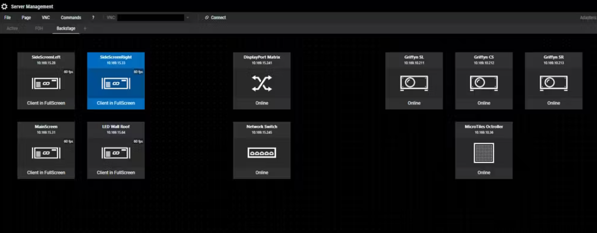

3) After clicking on the icon, you would be directed to an interface called the **PB Menu** with different applications.

4) In PB Menu, click on **Pandora Box**.

   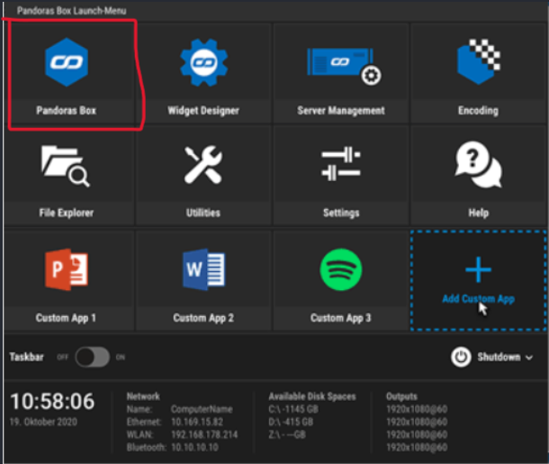

5) You would be shown a client interface. In that page, click on **Full Screen**.

   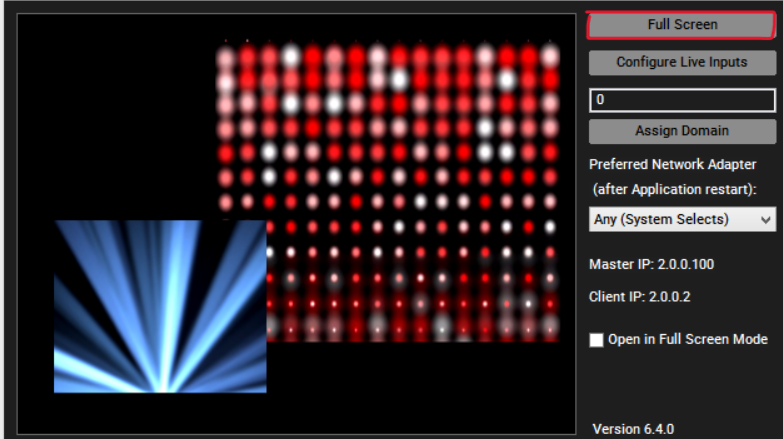

### Christie Pandora Box

1) To use Christie pandora box, you would need to download both the Christie pandora box and PB management application. You would also need to obtain a license to use the software. 

2) If all requirements have been fulfilled, you may procced to plug in the dongle that contains the license to use the application into either the laptop if running on local, or a media server if u have one.

3) For the Pandora Box application, simply create a new project to start off. Subsequently, you may either use the assets given by Christie in their own **Christie folder** in **Windows(C:)**, or add your own content by adding into the **Christie folder**.

4) To add your own content, go to file explorer, click on **Windows(C:)**. Then find and click on **Christie**. 

5) In the **Christie folder**, click on **content**. Then drag the content you will be using into the **content folder**.

6) To project out your content, drag the content to a layer in the timeline in pandora box. 

7) To preview your content in pandora box, **right click on local or desktop**, find and click on **toggle preview**. 

8) As this software is a projection software, we can also add something called **editable mesh**, to help us size and fit our content depending on our display area. Right click on your project folder and click on **Add Editable Mesh**. You may rename the mesh to your liking.

9) As we are using a phidget control system, we will be adding cues to our video timeline.

10) To add a cue, go to the time you wish to add a cue, right click, and click on **Add Cue Here**.

11) There are different functions in cue, **Play, Pause, Stop, Jump and Wait**:
    * **Play** function is a play button
    * **Pause** function pauses the video at that the current cue time
    * **Stop** function stops the entire sequence/timeline from playing
    * **Jump** function jumps the cue/time that u have set to jump to
    * **Wait** function delays the video depending on the wait time set

---

## Interactivity

### Station 1
1) This is the set up for station 1:

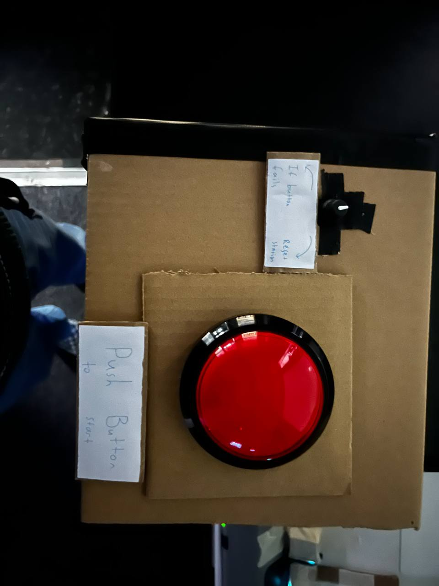

We have a button and a Rotary potentiometer. The button is used to start the station, while the Rotary potentiometer is to reset the station as well as a backup for if the button fails.

#### Side View
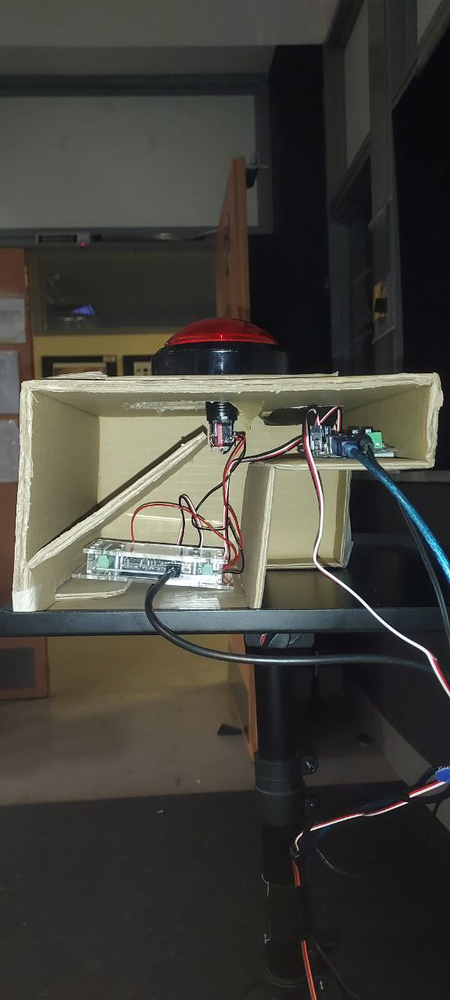

For the button and Rotary potentiometer to work, we used a Phiget Interface 8/8/8 kit to power, transmit and receive protocols from PB. 

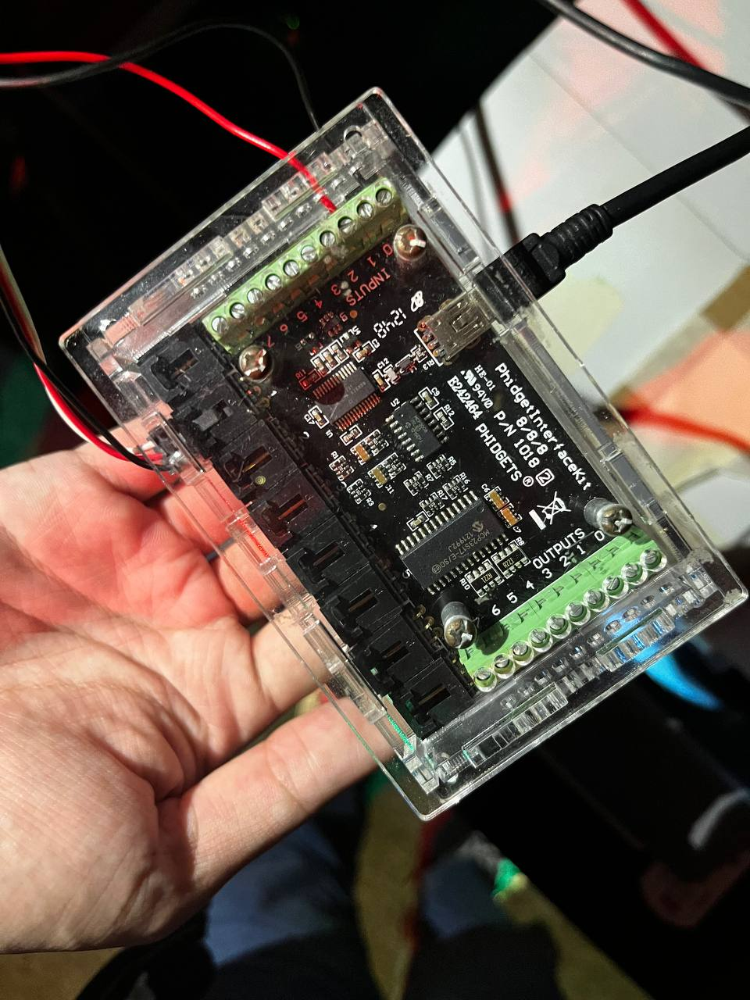

#### Shadow Puppetry Element
This station has a shadow puppetery element. This shadow puppetery is achieved by attaching a model to a servo motor.

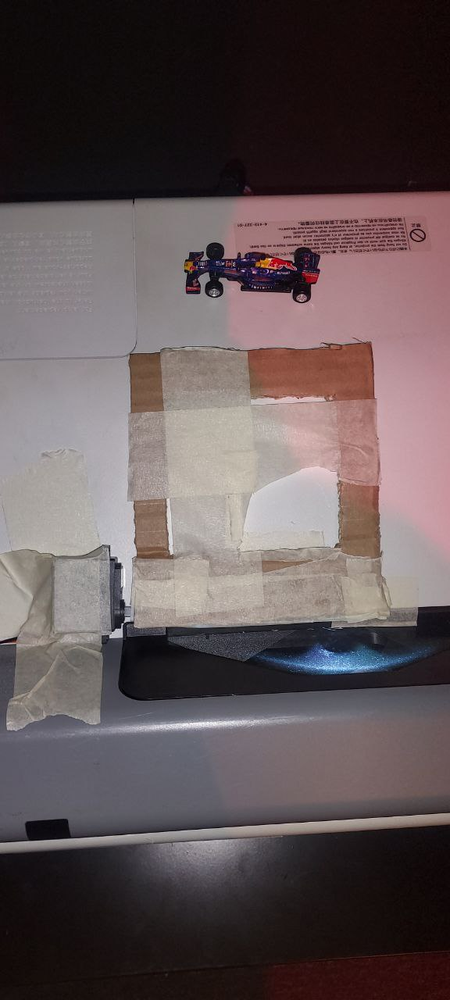

This servo motor is timed on PB using WD for it to move into position and move away at the right moment while the video is running.

**Video of servo motor in action:**
*[Video can be found in the Interacting Folder - Station_1_servo_moving]*

**Video of how servo motor affects video:** 
*[Video can be found in the Interacting Folder - Station_1_servo_effect]*

The servo motor is being driven by a **PhidgetAdvancedServo 8-Motor** which is a servo controller.

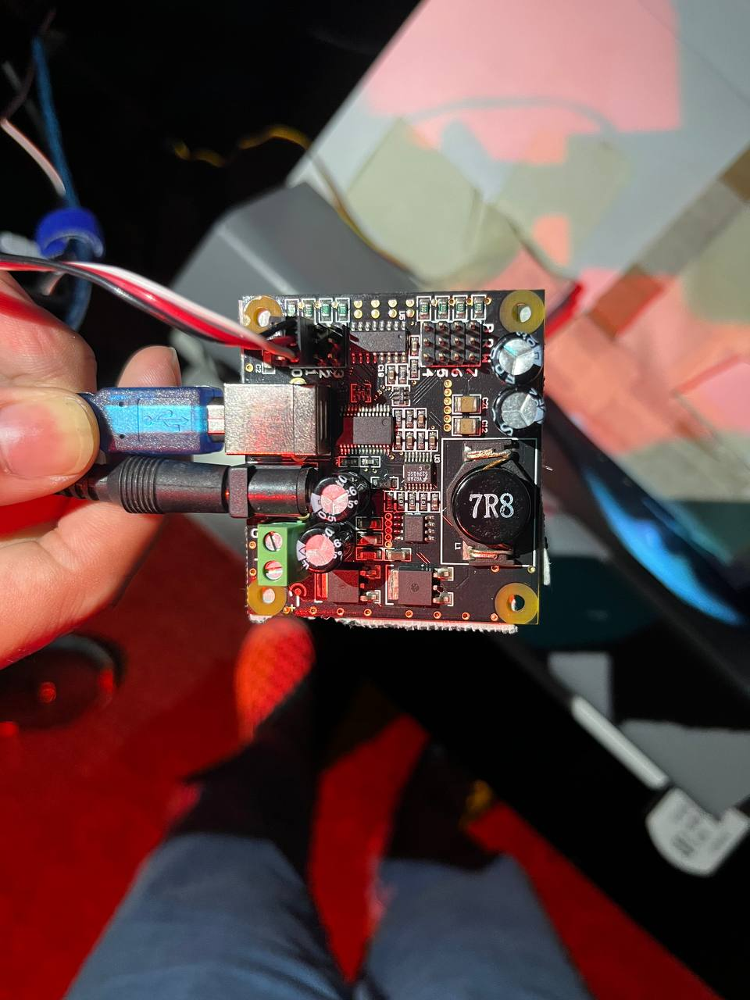

#### Station 2

This is the set up for station 2:

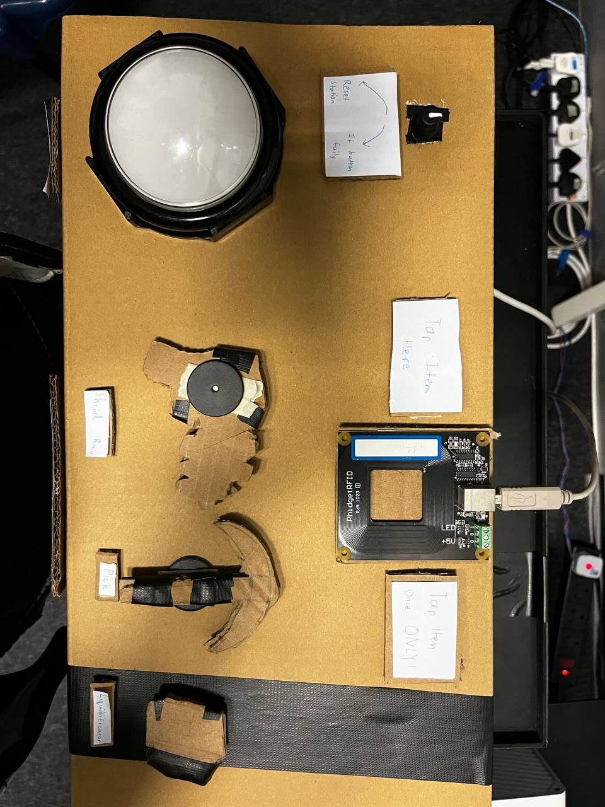

For this station's interactivity, we used RFID, buttons and rotary potentiometer. 

#### Side View

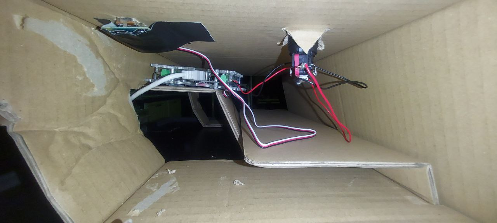

For station 2, we used RFID tags to let users pick their choices for the game. 

For users to select their choice, they would have to use these RFID disks and tap it on the RFID reader. This would jump the video to  play the option which users have selected. 

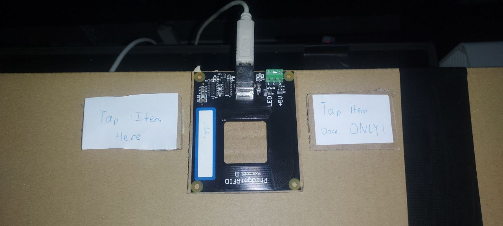

To help with the identification of the disk, we made cut outs of the options given to the users and stuck the RFID disks to to back of the cut outs. 

#### Front
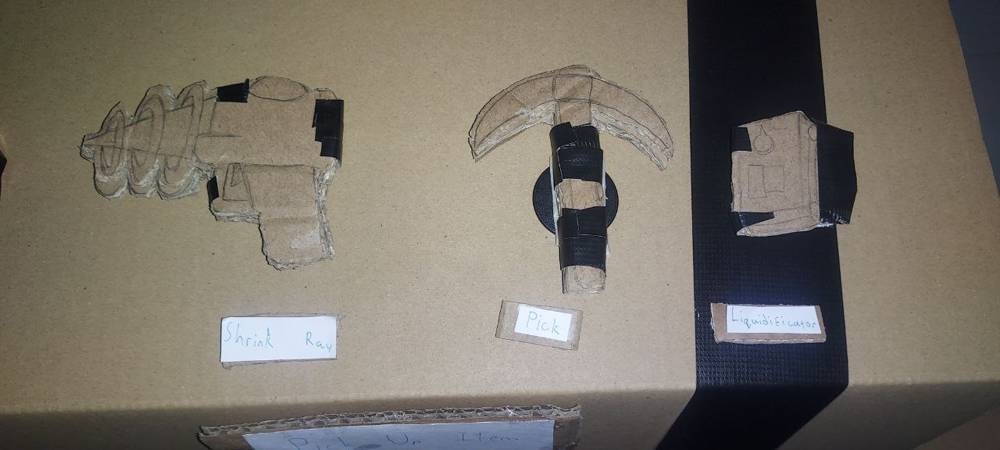

#### Back
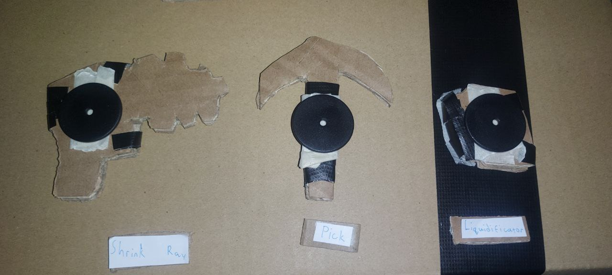

Out of the three options, only one of them is correct *[the middle option **(pick)**]*. When users select the wrong option, the video shown to them will be a fail screen. 

After choosing the right answer, the video will progress the story and give users context of the next station before they have to move on the the 3rd station.

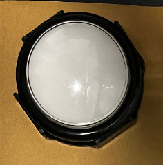

The Rotary potentiometer for this station resets the station as well as act as a backup for if the button fails to work.

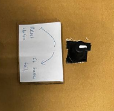

---

## Troubleshooting

### Installation:
* Check that there is power running for all equipment that requires power.
* Make sure that all cables are plugged in properly.
* If HDMI Extenders or USB Extenders are used, make sure that the **Link** is lighted to the supposed colour.
* Do ensure that the cable connection for HDMI Extenders or USB Extenders are not lose if the equipment are being used.
* For the audio speakers, make sure that both inputs from the amplifier have GND.
* Ensure that there is power to power on the DMX Driver if not the light **(LED Strips)** would not be turned on. 

### Operational:

#### PB Management 
* If you press **X** on the client interface and when you press Pandora Box and it says it is open when you have closed it:
    1) Find **Taskbar** and switch it on
    2) Now, you should be able to see the taskbar in your PB Menu page
    3) Find the Pandora Box tab and click on it to get back the Pandora Box client interface

* Ensure that the IP address of the laptop is the same as the PB management too.

#### Christie Pandora Box
* Make sure that dongle is plugged in either in the server or laptop

* If the projector has been switched on and off, and content is not displayed:
   1) Save your file first
   2) Close **Christie Pandora Box** and in PB management, click on **disconnect**
   3) After you have disconnected, you may either:
      - Close the whole PB Management
        OR
      - Right Click on the box which says Server[Number depends on how many servers you have]
      - Find **System** and in that tab, click on **Reboot**

* If you are unable to preview your content in pandora box:
   1) Make sure that you have clicked on **toggle preview**
   2) In pandora box find and click on **all cameras** 

* If you can't find your mesh:
    1) In pandora box find and click on **all cameras** 
    2) Check which **layer output** you are on 

#### Widget Designer
* If open up Phidget Control panel with Widget designer and sensor not working:
    1) Save your File first
    2) Close both applications
    3) Now open up Widget Designer 
    4) Open your saved file 

---
