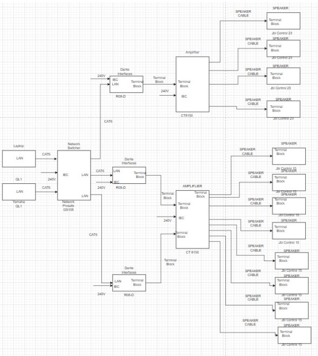

# Istor-a

## Content (For storyboard):
* Storyboard Images :  
* The Great Diamond heist/Stealing the Diamond
Station 1 :

 

Station 2:

 

Station 3:

 

 

Station 4 : 

---
# Setup Progress

## System Diagram for Video

---
## System Diagram for Audio

---
## System Diagram for Lighting

---
## System Diagram for Control
### Projector Control

### Phidget Control

#### Station 1 & 2

#### Station 3 & 4

---

## Floor Plan:
### Overall Top View

### Detailed Top View of 1 station

### Detailed Side View of 1 station

### Detailed of the equipments (placed at both top corner of the room)

---

## Installation
### Video System

1) In our setup, we are using two laptops. 1 laptop per 2 stations. They are powered using the power adapter.

2) From 1 of our laptops, we connect via LAN cable to the Media Server.

3) In order to use **Christie Pandora Box** (A projection mapping software), we require a licence for both the media server and the laptop.

4) From the Media Server, we had to use HDMI Extender **( Both TX and RX )** to one of the projector (1st station) via HDMI to LAN cable. Repeat the same step for the second projector (2nd station).

---

### Audio System
1) In  our setup, we will be using 4 passive speakers, 1 for each station. 
2) All 4 of the passive speakers will be connected to an ampliflier using speaker cables on channel 1 & 2 of the output.
3) the laptop will be connected to the amplifier's input using 3.5mm audio cable to terminal block.

Switch on the power button of the Crown CT875 Amplifier. Wait for about a few minutes until the "signal" and the "ready" light lit up (in green)

Turn the Input Attenuation to 0 dB

---
### Lighting System
1) From our setup, we connect to the Light DMX Driver via HDMI to DMX cable. 

2) Ensure that there is power to power on the DMX Driver if not the light **(LED Strips)** would not be turned on. *[Light is mainly used to tell audience where the 1st station is till the end]*

---
### Control System
#### Phidget Control System
**In this setup, we will are using 2 Phidget interfaces, 1 Phidget RFID and 1 Phidget Advance servo 8-Motor. 
  The interface we are using is the phidget interface 8/8/8.**

##### Station 1
1) The sensors we have in station 1 are:
    - 1 Rotary potentiometer
    - 1 Button
    - 1 Phidget Advance servo 8-Motor
    - 1 RC servo motor

2) The Phidget interface and Phidget Advance servo 8-Motor are connected to the laptop via USB-B to USB-A cable. We are using a usb extension in our setup due to the location of where the interface, servo motor and laptop are place.

3) The phidget interface consists of 7 digital and analog inputs.

4) The Rotary potentiometer is connected to one analog input, the Button is connected to one digital input.

7) The Button is to enable for the video to start

8) While the Rotary potentiometer is there as a backup for the button, it also enables the content to be replayable 
  through our program.

9) The Phidget Advance servo 8-Motor is connected seperately from the interface.

10) The RC servo motor is connected to 1 channel in the Phidget Advance servo 8-Motor.

5) For the interactivity to work, we will be using an application called **Widget Designer** to program the button and sensor.

6) Program Files can be found under **WD Files** in this GitHub Repository

##### Station 2
1) The sensors we have in station 2 are:
    - 1 Phidget RIFD 
    - 3 Phidget RFID discs
    - 1 Button
    - 1 Rotary potentiometer

2) The Phidget interface and the Phidget RFID are connected to the laptop via USB-B to USB-A cable. We are using a usb extension in our setup due to the location of where the Phidget interface, Phidget RFID and laptop are placed.

3) The phidget interface consists of 7 digital and analog inputs.

4) The Rotary potentiometer is connected to one analog input, the Button is connected to one digital input.

5) The Phidget RFID is connected to the laptop seperately from the interface.

6) The Button is to enable for the video to start

7) While the Rotary potentiometer is there as a backup for the button, it also enables the content to be replayable 
  through our program.

8) For the interactivity to work, we will be using an application called **Widget Designer** to program the button and sensor.

9) Program Files can be found under **WD Files** in this GitHub Repository

---
## Operational Phase:
### Christie Pandora Box

1) After downloading the Christie Pandora Box and Christie Pandora Server Management, you would need to buy the licence in order to run the pandora box

2) After having both the licence and the pandora box, open up the pandora server management, in the server management, you need to open the media server *(Direct connection from laptop to the media server with licence)*.

3) Afterwards, you can open the Pandora Box application, both laptop and the server management, create new project, and add video assets into the media server. Ensure that the video assets are on different layers and that the layers are not hidden

4) In order to mesh the video output to fit the screen output, you would need to right click on the folder, rename it for easy recognition, and mesh it to fit the screen that you are projecting the video onto.

---
## Interactivity

### Station 1
1) This is the set up for station 1:

We have a button and a Rotary potentiometer. The button is used to start the station, while the Rotary potentiometer is to reset the station as well as a backup for if the button fails.

#### Side View

For the button and Rotary potentiometer to work, we used a Phiget Interface 8/8/8 kit to power, transmit and receive protocols from PB. 

#### Shadow Puppetry Element
This station has a shadow puppetery element. This shadow puppetery is achieved by attaching a model to a servo motor.

This servo motor is timed on PB using WD for it to move into position and move away at the right moment while the video is running.

**Video of servo motor in action:**

**Video of how servo motor affects video:**

The servo motor is being driven by a **PhidgetAdvancedServo 8-Motor** which is a servo controller.

#### Station 2

This is the set up for station 2:

For this station's interactivity, we used RFID, buttons and rotary potentiometer. 

#### Side View

For station 2, we used RFID tags to let users pick their choices for the game. 

For users to select their choice, they would have to use these RFID disks and tap it on the RFID reader. This would jump the video to  play the option which users have selected. 

To help with the identification of the disk, we made cut outs of the options given to the users and stuck the RFID disks to to back of the cut outs. 

#### Front

#### Back

Out of the three options, only one of them is correct [the middle option (pick)]. When users select the wrong option, the video shown to them will be a fail screen. Users would have to then press the white button in order to restart and go back to the point where they are presented with the options again.

After choosing the right answer, the video will progress the story and give users context of the next station before they have to move on the the 3rd station.

The Rotary potentiometer for this station  resets the station as well as act as a backup for if the button fails to work.

---
## Testing Phase
---

### Stealing the Diamond
1) You are playing as the main character(Henry Stickmin). After the events of Escaping the Prison, you are resting at home. 

2) You tune in to the television where you see the mayor annoucing the grand opening of the new museum. Within the new exhibits sits a priceless diamond.

3) Knowing the value of the diamond, you sought to steal the diamond to pay off his late rent of his house.

4) You will be given several options to choose from to aid your character to successfully steal the diamond.

---
### Troubleshooting
---
