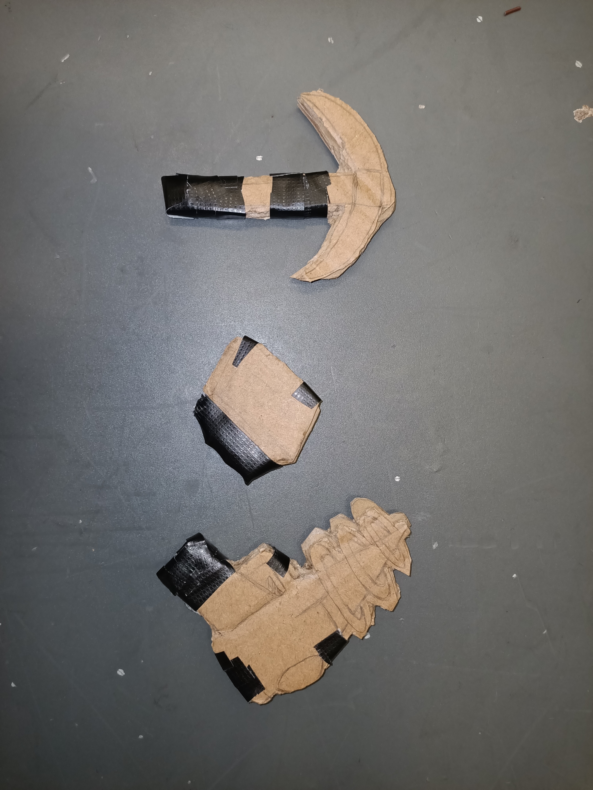
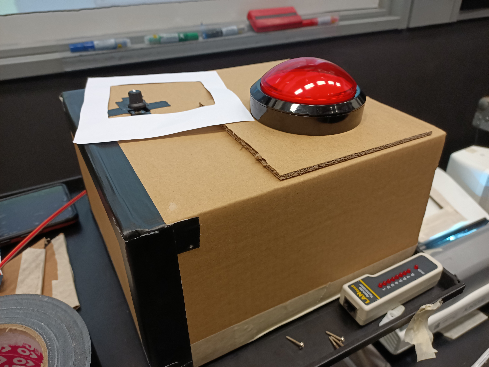

# Istor-a

## Documentation:
---

* **Floor Plan(planning of where equipment and props will be placed)**

* **Plan out Content( Storyboard the Content)**

* **Planning of props for interactivity(The usage of props for audience to interact with)**

* **System Diagram for Video**

* **System Diagram for Lighting**

* **System Diagram for Audio**

* **System Diagram for Control**

---

## Floor Plan:
* **Overall Top View**

* **Detailed Top View of 1 station**

* **Detailed Side View of 1 station**

---
## Content (For storyboard):
* Link to Storyboard : <https://docs.google.com/document/d/13bTYwS7OguV5ErM58ChDM_zm_8Gb3v3b/edit?usp=sharing&ouid=104765151469211705872&rtpof=true&sd=true>

* Storyboard Images :  

Station 1 :

 

Station 2:

 

Station 3:

 

 

Station 4 : 

---
# **Setup Progress**

## **System Diagram for Video**

---
## **System Diagram for Audio**

---
## **System Diagram for Lighting**

---
## **System Diagram for Control**
* **Projector Control**

* **Phidget Sensor System Control**

---

## Video Installation

1) In our setup, we are using two laptops. 1 laptop per 2 stations. They are powered using the power adapter.

2) From 1 of our laptops, we connect via LAN cable to the Media Server.

3) In order to use Christie Pandora Box **( A projection mapping software )**, we require a licence for both the media server and the laptop.

4) From the Media Server, we had to use HDMI Extender **( Both TX and RX )** to one of the projector( 1st station ) via HDMI to LAN cable. Repeat the same step for the second projector( 2nd station ).
---
## **Audio Installation**

---
## **Lighting Installation**
1) From our setup, we connect to the Light DMX Driver via HDMI to DMX cable. 

2) Ensure that there is power to power on the DMX Driver if not the light **( LED Strips )** would not be turned on. *[Light is mainly used to tell audience where the 1st station is till the end]*
---
## Control Installation

---
# Operational Phase:
## Christie Pandora Box
---

1) **After downloading the Christie Pandora Box and Christie Pandora Server Management, you would need to buy the licence in order to run the pandora box**

2) **After having both the licence and the pandora box, open up the pandora server management, in the server management, you need to open the media server *(Direct connection from laptop to the media server with licence)*.**

3) **Afterwards, you can open the Pandora Box application, both laptop and the server management, create new project, and add video assets into the media server. Ensure that the video assets are on different layers and that the layers are not hidden**

4) **In order to mesh the video output to fit the screen output, you would need to right click on the folder, rename it for easy recognition, and mesh it to fit the screen that you are projecting the video onto.**
---
## **Props used for interaction**
---

1) **The props below is for the audience to use to interact when they have to select different options to progress the storyline**

2) **The pickaxe is used to proceed the storyline(the right answer).**

3) **The other 2 options are the wrong answers where the video will proceed to play other scenerios until the right answers are chosen.**

* The button below is used for audience intraction, to start the sequence of the video

---
## Testing Phase
---

### **Stealing the Diamond**
1) You are playing as the main character(Henry Stickmin). After the events of Escaping the Prison, you are resting at home. 

2) You tune in to the television where you see the mayor annoucning the grand opening of the new museum. Within the new exhibits sits a priceless diamond.

3) Knowing the value of the diamond, you sought to steal the diamond to pay of his late rent of his house.

4) You will be given several options to choose from to aid your character to successfully steal the diamond.
---
## Troubleshooting
---