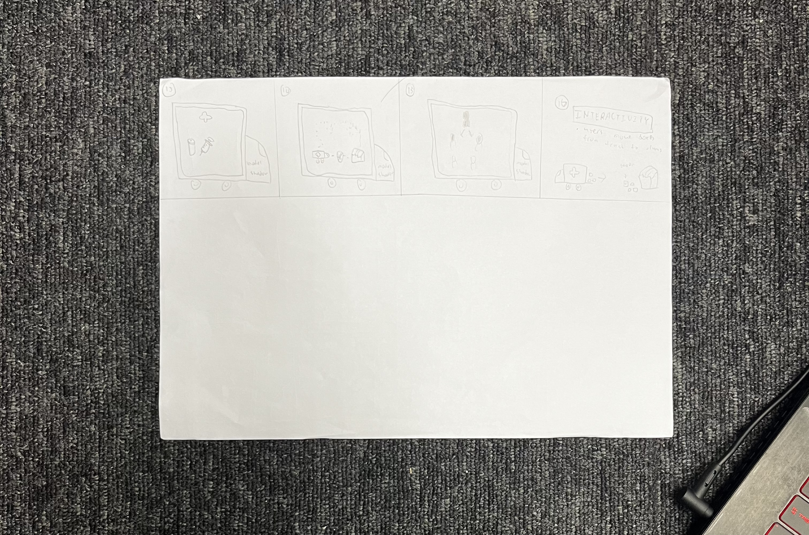

# Istor-a

## Documentation:
---

* **Floor Plan(planning of where equipment and props will be placed)**

* **Plan out Content( Storyboard the Content)**

* **Planning of props for interactivity(The usage of props for audience to interact with)**

* **System Diagram for Video**

* **System Diagram for Lighting**

* **System Diagram for Audio**

* **System Diagram for Control**

---

## Content (For storyboard):
* Link to Storyboard : <https://docs.google.com/document/d/1KEb-f6_v6F4EKD2sPoBHARdEkY_rYMqPzDgraHSt4g8/edit?usp=sharing>

* Storyboard Images :  

Station 1 :

 

Station 2:

 

Station 3:

 

 

Station 4 : 

